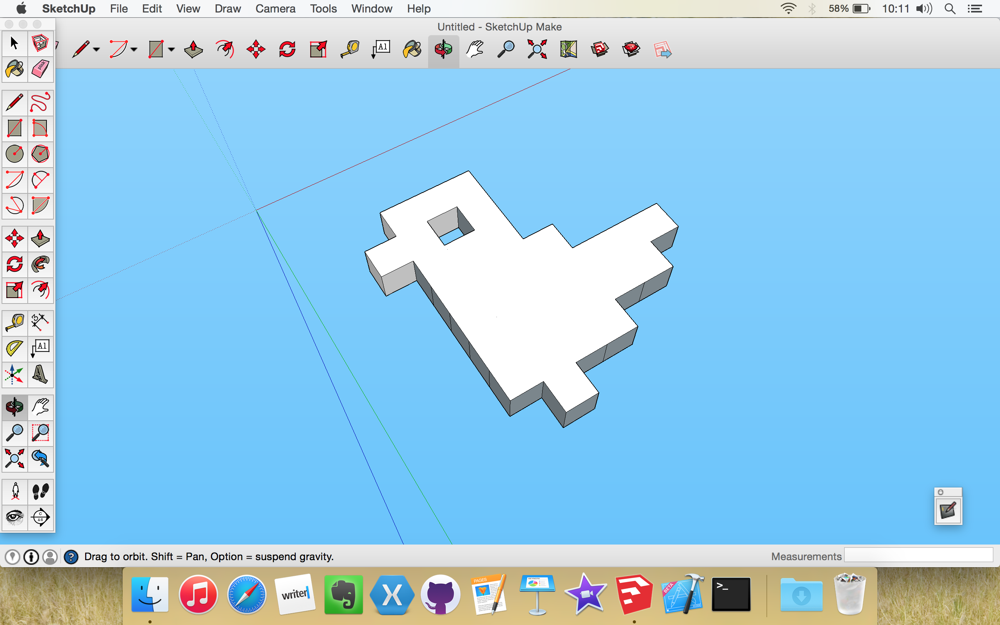
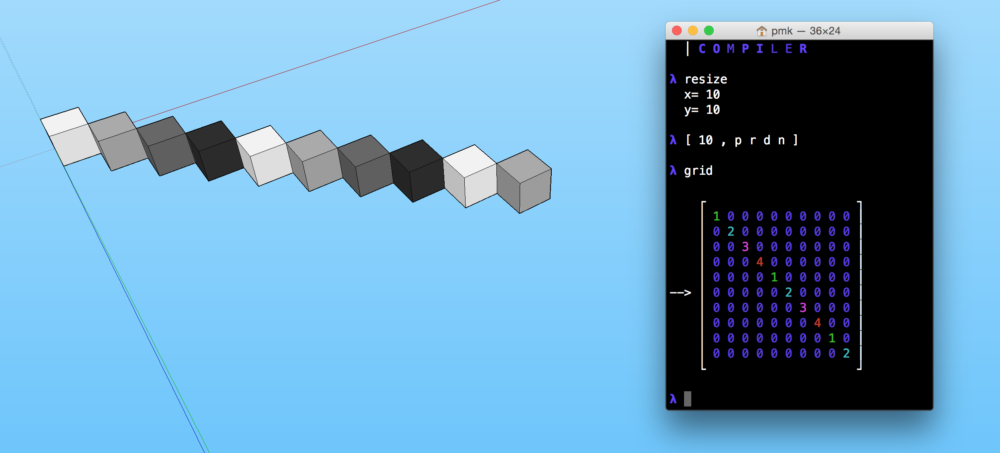

<br />

# SketchUp Grid Importer
Have you ever wanted to 3D Print your Arendelle drawings? Well using the new tools from Arendelle you can! Our both major Arendelle 2 engines [JArendelle](https://github.com/arendelle/jarendelle) and [Swifty](https://github.com/arendelle/swifty) now support a new file format called the "Grid File" which let us save the result of your Arendelle app. Then with apps like this you can load the Gird in places you want.

<br /><br />

## How?
#### Step 1
Get the last developer-desktop version of one of the major Arendelle Engines: [JArendelle](https://github.com/arendelle/jarendelle) and [Swifty](https://github.com/arendelle/swifty).

#### Step 2
Run your Arendelle code and wait till it finishes

#### Step 3
In JArendelle use `Export Grid` button, give it a name and choose where you want to save your Grid file

In Swifty REPL use command `save` and with the name of the file you want as its argument like `save model` and it will save it aa `model.grid` in your home directory

#### Step 4
Get [Trimble SketchUp Make](http://www.sketchup.com/products/sketchup-make) (If you have SketchUp Pro, well good for you! But we don't need that. The Free SketchUp Make is more than enough)

#### Step 5
Clone or download this repo as zip. Then copy the file in `src` folder. Then in mac paste it to:

```
/Users/<your_mac_user_name>/Library/Application Support/SketchUp [n]/SketchUp/Plugins
```

And in Windows to:

```
C:\Users\<your_windows_user_name>\AppData\Roaming\SketchUp\SketchUp [n]\SketchUp\Plugins
```

#### Step 6
In SketchUp use from the menu `File` click on the `Import Arendelle Grid	`. Choose the Grid file you exported in step 3 and here it is your Arendelle model, 3D in your SketchUp.



#### Step 7
Now that you know how to import your Arendelle model to SketchUp you can do whatever you want with it. If you want to do 3D Printing, I suggest installing [this](https://extensions.sketchup.com/en/content/sketchup-stl) plugin and exporting the model to `STL` file format. Something that 3D Printers use.

<br /><br />


## License

```
SketchUp Arendelle Grid Importer
   Copyright (c) 2015-2016 Kary Foundation, Inc.
   Author: Pouya Kary <k@karyfoundation.org>


This program is free software: you can redistribute it and/or modify
it under the terms of the GNU General Public License as published by
the Free Software Foundation, either version 3 of the License, or
(at your option) any later version.

This program is distributed in the hope that it will be useful,
but WITHOUT ANY WARRANTY; without even the implied warranty of
MERCHANTABILITY or FITNESS FOR A PARTICULAR PURPOSE.  See the
GNU General Public License for more details.

You should have received a copy of the GNU General Public License
along with this program.  If not, see <http://www.gnu.org/licenses/>.
```

